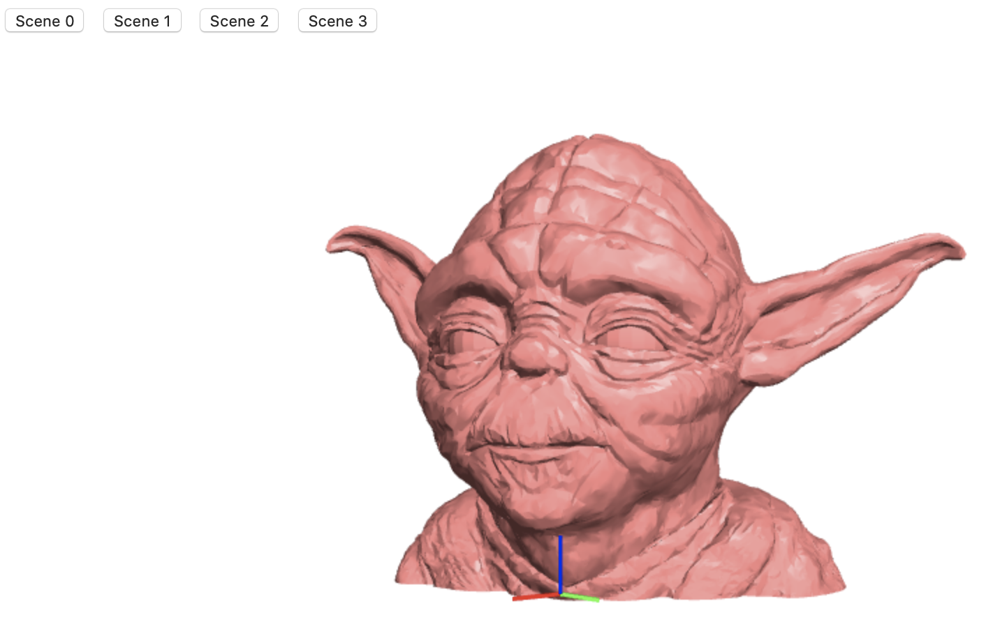

# JSCAD Render (Typescript)

JSCAD application insipred by https://github.com/jscad, https://openjscad.org, http://opencsg.org and the older https://github.com/evanw/csg.js.

## How to run

    git clone https://github.com/peter-hartmann/jscad-render-ts.git
    cd jscad-render-ts
    yarn
    yarn start

## Use

Navigate to [http://127.0.0.1:8080](http://127.0.0.1:8080).  Click the buttons to switch between models.  Drag the mouse to rotate, mouse wheel to zoom, SHIFT key + mouse drag to pan.
Some of the models are 'borrowed' from http://opencsg.org.